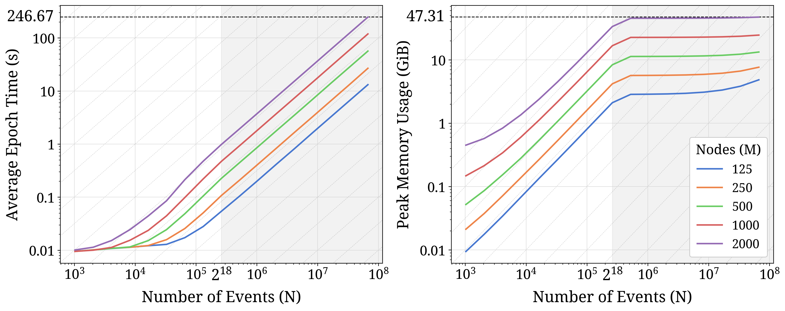
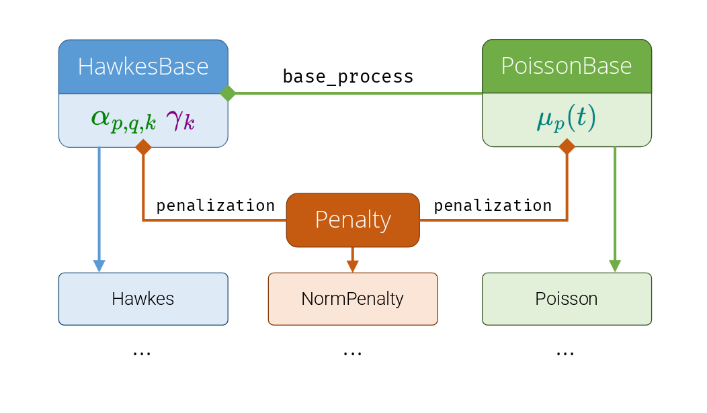

# HawkesTorch

<p align="center">
  <a href="https://arxiv.org/abs/2604.01342"></a>
  <a href="https://github.com/ahmrr/hawkestorch/blob/main/LICENSE"></a>
  <a href="https://www.python.org/"></a>
</p>

A PyTorch library for learning multivariate Hawkes processes, with a focus on **extensibility**, **speed**, and **scalability**.

**[Overview](#overview) · [Quick Start](#quick-start) · [Organization](#library-organization) · [Documentation](#documentation) · [Future Work](#future-work) · [Citation](#citation)**

## Overview

This library is designed around **multivariate linear exponential Hawkes processes**, which have intensity functions of the form:
```math
\lambda_p(t) = \textcolor{teal}{\mu_p(t)} + \sum_{j: t_j < t} \sum_{k=1}^K \textcolor{green}{\alpha_{p, m_j,k}}\textcolor{purple}{\gamma_k} e^{-\textcolor{purple}{\gamma_k}(t - t_j)}
```
 - $\textcolor{teal}{\mu_p(t)}$ is the base intensity of node $p$ at time $t$ (a Poisson process)
 - $\textcolor{green}{\alpha_{p, q, k}}$ is the influence of node $q$ on node $p$ on timescale $k$
 - $\textcolor{purple}{\gamma_k}$ is the decay rate of timescale $k$

and

- $N$ is the number of **events** in the sequence
- $M$ is the number of **dimensions** (nodes) in the process
- $K$ is the number of **kernels** in the model (timescales of influence)
- $t_i\in [0, T]$ is the time of the $i$-th event
- $m_i\in \{1,\dots,M\}$ is the **dimension** (node type) of event $i$

We implement a highly parallel algorithm for fitting Hawkes processes via **exact maximum likelihood estimation**. This allows scaling to massive datasets; e.g., $\sim 1,\!000$ nodes and $10,\!000,\!000$ events. Therefore, a GPU or many CPU cores are recommended to realize these speedups.

<br>

<figure>

<figcaption style="text-align: center;">

Per-epoch time (left) and memory usage (right) on an Nvidia A100 GPU with $K=3$.

</figcaption>
</figure>

<br>

See [our paper](https://arxiv.org/abs/2604.01342) for experiment results and more details on the optimizations done for this library.

## Quick Start

For a detailed worked example of simulation, fitting, and evaluation, see `examples/full_example.ipynb`.

### Installation

The main prerequisite is PyTorch, ideally with GPU support, and `matplotlib` to run the plotting code. The `numpy` package is also required to run some of the examples.

Since this library is under active development, it will be updated frequently to add features and fix bugs. We recommend installing via `pip` directly from GitHub so you can easily pull in the latest updates:

```bash
pip install git+https://github.com/ahmrr/HawkesTorch
```

Alternatively, you can add this repo as a submodule to your project if you
want to modify the source.

### Basic Usage

Here is an example of simulating a Hawkes process and fitting a model to it. See `examples/full_example.ipynb` for a more detailed walkthrough.

```python
import torch

from hawkes import models
from hawkes.utils import config

# Simulate data

M = 10  # number of nodes
N = 100000  # number of events
sim_gamma = torch.tensor([1.5]) # decay rate
sim_mu = torch.tensor([0.1] * M) # constant base rate
sim_alpha = torch.rand(1, M, M) * 0.5 # influence (K x M x M)

sim_base_process = models.Poisson(M, mu_init=sim_mu)
sim_model = models.Hawkes(
    gamma=sim_gamma,
    gamma_param=False,
    base_process=sim_base_process,
    alpha_init=sim_alpha,
)

seq = sim_model.simulate(max_events=N)

# Fit model

est_gamma = torch.tensor([1.0]) # initial decay rate

est_base_process = models.Poisson(M)
est_model = models.Hawkes(
    gamma=est_gamma,
    gamma_param=True, # allow learning the decay rate
    base_process=est_base_process,
)

fit_config = config.FitConfig(
    num_steps=4000, # epochs to train for
    monitor_interval=400, # how often to print training progress
    learning_rate=0.1, # learning rate for Adam optimizer
)

stats = est_model.fit(seq, fit_config) # returns dict of training details
```


## Organization

<br>

<figure>

<figcaption style="text-align: center;">

Arrows indicate inheritance, diamonds indicate composition.

</figcaption>
</figure>

<br>

Most functionality is implemented in three main abstract base classes. Subclasses of these implement specific Hawkes and Poisson parameterizations and penalizations, which you can also extend to your own use cases.

- `HawkesBase`: Provides intensity and likelihood computation, as well as `fit` and `simulate` methods. Subclasses implement custom parameterizations of $\textcolor{green}{\alpha_{p, q, k}}$ and $\textcolor{purple}{\gamma_k}$, e.g., low-rank, sparse, etc.

- `PoissonBase`: Represents the base rate $\textcolor{teal}{\mu_p(t)}$ and is used in `HawkesBase` via the `base_process` attribute. Also provides standalone `fit` and `simulate` methods, if raw Poisson fitting is desired. Subclasses implement custom parameterizations of the time-varying base rate.

- `Penalty`: An abstract `dataclass` that represents a regularization term added to the log-likelihood during fitting. Extend this to create custom penalties beyond those already implemented. Penalties are attached to a model via the `penalization` attribute, which accepts a `dataclass` that stores `Penalty` instances for each parameter.


To implement your own Hawkes or Poisson process, or to add custom penalization, please reference:
- Files in `examples/templates` for templates you can copy and modify. 
- The `HawkesBase`, `PoissonBase`, and `Penalty` base classes for core methods that are already implemented.
- The `Hawkes`, `HawkesLowRank`, `Poisson`, `PoissonFourier`, and `NormPenalty` subclasses for concrete implementation examples.

## Documentation

There will be an [API Reference]() available soon with detailed documentation and examples. In the meantime, please refer to the code, docstrings, examples, and paper.

## Future Work

- [ ] Even faster likelihood computation via a custom CUDA implementation (using CUB `DeviceScan`)

- [ ] More `PoissonBase` models (e.g., piecewise constant, splines, etc.)

- [ ] API documentation 

If you encounter a bug or have a feature request, please feel free to [open an issue](https://github.com/ahmrr/hawkestorch/issues).

## Citation

If you find this library to be useful in your research, please cite the following [paper](https://arxiv.org/abs/2604.01342):

```bibtex
@article{raza2026hawkestorch,
  title = {Massively Parallel Exact Inference for Hawkes Processes},
  author = {Raza, Ahmer and Smith, Hudson},
  journal = {arXiv preprint arXiv:2604.01342},
  year = 2026,
}
```
